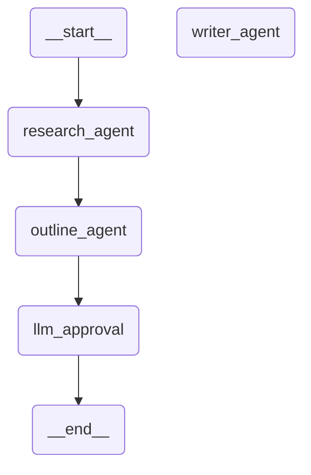

```mermaid
graph TD;
	__start__(<p>__start__</p>)
	research_agent(research_agent)
	outline_agent(outline_agent)
	writer_agent(writer_agent)
	llm_approval(llm_approval)
	__end__(<p>__end__</p>)
	__start__ --> research_agent;
	outline_agent --> llm_approval;
	research_agent --> outline_agent;
	llm_approval --> __end__;
	classDef default fill:#f2f0ff,line-height:1.2
	classDef first fill-opacity:0
	classDef last fill:#bfb6fc
```